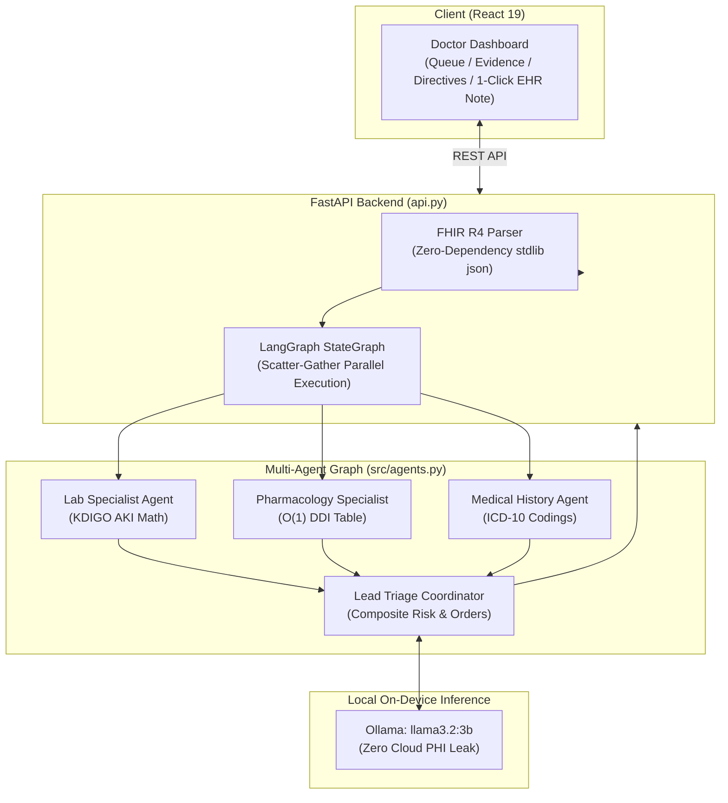

# AegisClinical: Multi-Agent Clinical Decision Support System (CDSS)

> **An autonomous multi-specialty clinical intelligence team for electronic health records (EHR) powered by LangGraph, Local SLM (Ollama), and React.**

[](LICENSE)
[](https://www.python.org/)
[](https://react.dev/)
[](https://github.com/langchain-ai/langgraph)
[-green.svg)](https://ollama.ai/)
[](https://fastapi.tiangolo.com/)

---

## Overview

Modern Electronic Health Records (EHR) are vast and fragmented: multi-year lab panels, dozens of concurrent prescriptions, and dense encounter narratives. Single-prompt monolithic LLMs regularly hallucinate medical math or overlook contraindications when faced with this volume of data.

**AegisClinical** addresses this by dividing clinical evaluation across **specialized AI agents** operating in parallel on a deterministic graph:

1. **🧪 Laboratory Specialist Agent**: Tracks longitudinal analyte deltas and executes **KDIGO 2012 clinical criteria** for Acute Kidney Injury (AKI) staging, alongside critical panic value detection ($K^+$, $Hb$, $Na^+$).
2. **💊 Pharmacology Specialist Agent**: Executes $O(1)$ rule-matching against fatal drug combinations (e.g. *The Triple Whammy: ACEi + Diuretic + NSAID*, *Dual RAAS Blockade*, *Warfarin + NSAID*) and flags drug-disease contraindications.
3. **📋 Medical History Specialist Agent**: Extracts active chronic comorbidities with standard ICD-10-CM coding.
4. **🎯 Lead Triage Coordinator**: Aggregates multi-specialty evidence, assigns an urgency priority (**HIGH**, **MEDIUM**, **LOW**), formulates immediate physician directives, and uses a local SLM (`llama3.2:3b`) for clinical synthesis.

---

## 🚀 Quickstart (60 Seconds)

### Prerequisites
* Python 3.10+
* Node.js 18+ (for frontend development)
* [Ollama](https://ollama.ai/) (optional, for local LLM synthesis)

### 1. Clone the Repository
```bash
git clone https://github.com/Rahmman001/Multi-Agent-Clinical-Support.git
cd Multi-Agent-Clinical-Support
```

### 2. Pull the Local Model (Optional but Recommended)
```bash
ollama pull llama3.2:3b
```
*(Note: If Ollama is not installed or offline, the system automatically uses deterministic clinical synthesis fallback).*

### 3. Run with One Command
```bash
./start.sh
```
Or manually:
```bash
# Setup Python environment
python3 -m venv .venv && source .venv/bin/activate
pip install -r requirements.txt

# Start the unified server
python api.py
```

👉 Open **[http://localhost:8000](http://localhost:8000)** in your browser!

For frontend hot-module reloading during development:
```bash
cd frontend
npm install
npm run dev
# Visit http://localhost:5173
```

---

## 📐 Architecture & Workflow



---

## 🔒 Privacy & HIPAA-Conscious Design

* **Zero Cloud Data Transfer**: All patient evaluations and inference occur entirely on your local machine. No Protected Health Information (PHI) is ever transmitted to OpenAI, Anthropic, or external APIs.
* **Synthetic Test Data**: Built-in test fixtures use open-source [Synthea](https://synthetichealth.github.io/synthea/) synthetic patient records (`data/patients/`).
* **Deterministic Guardrails**: Critical drug contraindications and kidney failure formulas are calculated via deterministic Python mathematics—not statistical LLM guesses.

---

## 🧪 Automated Testing

The project includes unit and integration tests covering parser extraction, clinical rules, multi-agent graph orchestration, and API endpoints:

```bash
# Run the test suite
pytest tests/ -v
```

All 15 tests pass with zero external network dependencies.

---

## 🤝 How to Contribute

Contributions are warmly welcome! To contribute:

1. **Fork** the repository.
2. Create a feature branch (`git checkout -b feature/new-clinical-rule`).
3. Commit your changes with clear messages (`git commit -m "feat: add QT-prolongation DDI rules"`).
4. Verify tests pass (`pytest tests/ -v`).
5. Push to your branch and open a **Pull Request**.

---

## 📜 Medical Disclaimer

*AegisClinical is developed as an educational, research, and technical demonstration of multi-agent clinical decision support systems. It is not an FDA-cleared medical device and should not be used as the sole basis for clinical diagnosis or emergency medical care.*

---

## 📄 License

Distributed under the **MIT License**. See [`LICENSE`](LICENSE) for details.
